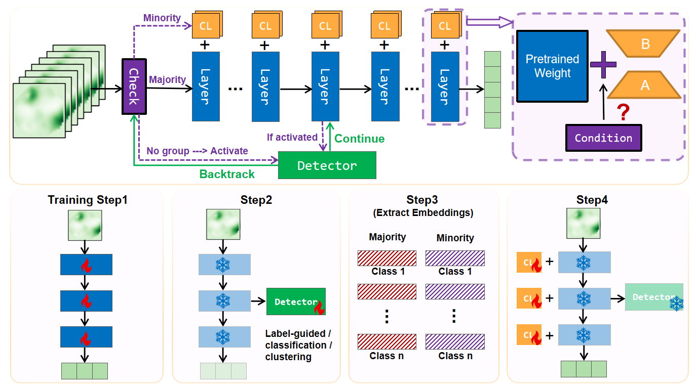

# FairNet: Dynamic Fairness Correction without Performance Loss via Contrastive Conditional LoRA

[](https://neurips.cc/)
[](LICENSE)
[](https://pytorch.org/)

**Authors:** Songqi Zhou, Zeyuan Liu, Benben Jiang*
<br>
**Affiliation:** Department of Automation, Tsinghua University

[Paper (arXiv)](https://arxiv.org/abs/2510.19421)

---

## 📖 Introduction

**FairNet** is a dynamic fairness correction framework accepted to **NeurIPS 2025**. It resolves the "performance-fairness trade-off" by selectively activating correction modules only for biased instances.

### Key Features
* **Dynamic Correction:** Uses a lightweight **Bias Detector** to identify and correct only biased samples.
* **No Performance Loss:** Improves Worst-Group Accuracy (WGA) without degrading overall accuracy.
* **Flexible:** Works with Full, Partial, or No sensitive attribute labels.

---

## 🖼️ Method

FairNet integrates a **Bias Detector** with **Conditional LoRA** adapters trained via a novel contrastive loss to align representations of minority and majority groups.


*Figure 1: The FairNet architecture. A bias detector selectively triggers LoRA modules, which are trained using contrastive loss to minimize intra-class disparities.* 

---

## 📊 Results

State-of-the-art performance on **CelebA** and **MultiNLI** datasets.

| Method | Setting | CelebA WGA | CelebA ACC | MultiNLI WGA | MultiNLI ACC |
| :--- | :--- | :--- | :--- | :--- | :--- |
| ERM | - | 77.9% | 95.8% | 67.3% | 82.6% |
| GroupDRO | Full Labels | 87.4% | 94.0% | 78.2% | 80.8% |
| **FairNet-Unlabel** | **No Labels** | **82.3%** | **95.8%** | **73.1%** | **82.5%** |
| **FairNet-Partial** | **Partial** | **86.5%** | **95.9%** | **76.5%** | **82.6%** |
| **FairNet-Full** | **Full Labels**| **88.2%** | **95.9%** | **78.5%** | **82.6%** |

---

## 🚀 Quick Start

### Installation
```bash
git clone [https://github.com/SongqiZhou/FairNet.git](https://github.com/SongqiZhou/FairNet.git)
cd FairNet
pip install -r requirements.txt
```
## 📝 Citation
```bash
@article{zhou2025fairnet,
  title={FairNet: Dynamic Fairness Correction without Performance Loss via Contrastive Conditional LoRA},
  author={Zhou, Songqi and Liu, Zeyuan and Jiang, Benben},
  journal={arXiv preprint arXiv:2510.19421},
  year={2025}
}
```
