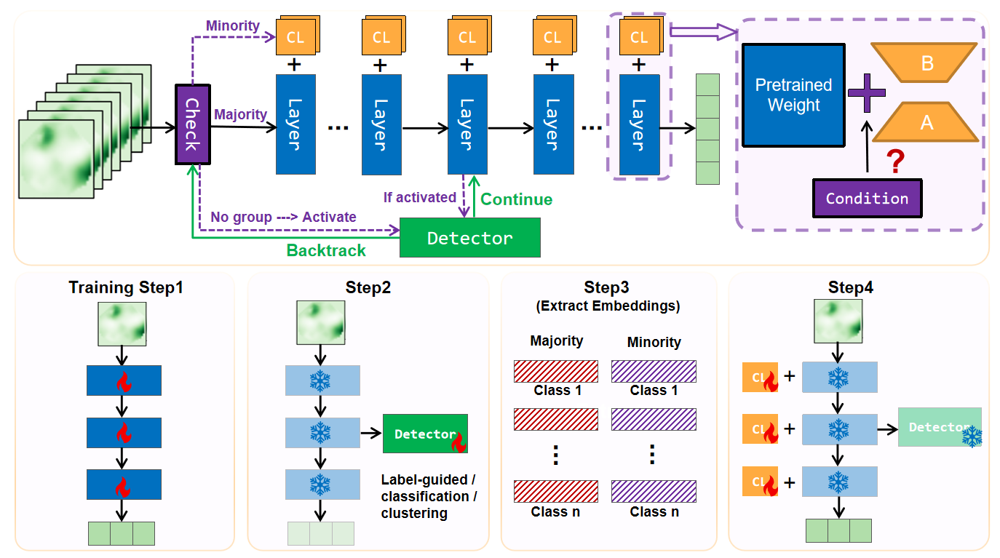

# FairNet

[](https://papers.nips.cc/paper_files/paper/2025/hash/81f2d59479a96afd8056db9468254515-Abstract-Conference.html)
[](https://github.com/SongqiZhou/FairNet/actions/workflows/ci.yml)
[](https://doi.org/10.52202/085713-3013)
[](LICENSE)

**FairNet** is the official research implementation accompanying the NeurIPS
2025 paper:

> **FairNet: Dynamic Fairness Correction without Performance Loss via
> Contrastive Conditional LoRA**<br>
> Songqi Zhou, Zeyuan Liu, and Benben Jiang<br>
> [Proceedings](https://papers.nips.cc/paper_files/paper/2025/hash/81f2d59479a96afd8056db9468254515-Abstract-Conference.html)
> · [PDF](https://papers.nips.cc/paper_files/paper/2025/file/81f2d59479a96afd8056db9468254515-Paper-Conference.pdf)
> · [arXiv](https://arxiv.org/abs/2510.19421)

FairNet adds lightweight bias detectors and conditional low-rank adapters to a
Transformer. The detector estimates whether an input belongs to a disadvantaged
group; only triggered samples receive the learned LoRA correction. The adapters
are trained with a targeted triplet loss that moves a minority representation
toward the same-class majority prototype and away from a different-class
prototype.



## What is implemented

- ViT models trained from scratch, matching the paper's CelebA backbone design.
- Pretrained BERT models for multiclass text classification.
- Independent detector and LoRA parameters for every sensitive attribute.
- Full, partial, and unlabeled sensitive-label settings.
- Binary and multiclass task losses and fairness evaluation.
- CelebA, UTKFace, and deterministic synthetic vision datasets; text datasets
  can use the documented batch contract below.

The maintained import package is `fairnet`. The original repository used the
misspelled directory name `scr`; it remains as a deprecated compatibility alias
so older `from scr import ...` code keeps working.

## Method and training pipeline

FairNet follows the paper's four conceptual stages:

1. **Base preparation:** train the backbone and task head with empirical risk
   minimization while detector and LoRA parameters are frozen.
2. **Bias detection:** choose the switch according to sensitive-label
   availability.
3. **Static targets:** use the frozen ERM representation to compute prototypes
   for task-class and sensitive-group combinations.
4. **Conditional correction:** freeze the base and detectors, then train only
   the LoRA matrices on minority anchors with the contrastive objective.

The three variants differ at stages 2–4:

| Variant | Sensitive labels during training | Switch used at inference | Contrastive anchors |
| --- | --- | --- | --- |
| `FairNet-Full` | Complete | Ground-truth binary group label | Ground-truth minority samples |
| `FairNet-Partial` | A configurable labeled fraction | Learned detector | Labeled minority subset |
| `FairNet-Unlabeled` | None | Detector trained from LOF pseudo-labels | Pseudo-minority samples |

Full mode intentionally does **not** train the MLP detector: Appendix C.3.1
defines the known group label itself as the deterministic switch. Consequently,
Full mode also requires sensitive labels at evaluation or deployment. Partial
and Unlabeled modes use a learned detector and do not pass group labels into the
model at inference.

For multiple binary sensitive attributes, FairNet creates a separate detector
and a separate `(A, B)` LoRA pair per attribute. Simultaneously triggered weight
updates are added, as described in Appendix C.3.3.

## Installation

Python 3.10–3.12 is supported. PyTorch installation varies by CUDA platform, so
install the appropriate build from [pytorch.org](https://pytorch.org/get-started/locally/)
first when GPU acceleration is required.

```bash
git clone https://github.com/SongqiZhou/FairNet.git
cd FairNet
python -m pip install -e .
```

For development and tests:

```bash
python -m pip install -e ".[test]"
pytest
ruff check .
```

## Quick start

The following is a small API smoke run, not the paper's full experimental
configuration. Increase model size and training epochs for research use.

```python
import torch
from transformers import ViTConfig

from fairnet import (
    AttributeMode,
    FairNetConfig,
    FairNetTrainer,
    FairNetViT,
    create_synthetic_loaders,
    evaluate_model,
    seed_everything,
)

seed_everything(42)
device = torch.device("cuda" if torch.cuda.is_available() else "cpu")

config = FairNetConfig(
    attribute_mode=AttributeMode.FULL,
    sensitive_attributes=[9],
    target_attribute=20,
    hidden_dim=192,
    detector_layer=1,
    lora_layers=[1, 2, 3],
    stage1_epochs=2,
    stage4_epochs=2,
    batch_size=32,
    device=str(device),
)
backbone_config = ViTConfig(
    image_size=64,
    patch_size=16,
    num_channels=3,
    hidden_size=192,
    num_hidden_layers=4,
    num_attention_heads=3,
    intermediate_size=384,
    hidden_dropout_prob=0.0,
    attention_probs_dropout_prob=0.0,
)

model = FairNetViT(backbone_config, config)
train_loader, validation_loader, test_loader = create_synthetic_loaders(
    batch_size=config.batch_size,
    num_train=512,
    num_val=128,
    num_test=128,
    image_size=backbone_config.image_size,
    seed=config.seed,
)

trainer = FairNetTrainer(model, config, device)
trainer.train_full(train_loader, validation_loader)
metrics = evaluate_model(model, test_loader, config, device)
print(metrics["accuracy"], metrics["worst_group_accuracy"], metrics["EOD"])
```

### Paper-scale CelebA backbone

Appendix C.2 uses a scratch-trained ViT with eight layers, eight attention
heads, 768-dimensional intermediate layers, 64×64 inputs, and 16×16 patches:

```python
from transformers import ViTConfig

paper_vit = ViTConfig(
    image_size=64,
    patch_size=16,
    num_channels=3,
    hidden_size=768,
    num_hidden_layers=8,
    num_attention_heads=8,
    intermediate_size=768,
)
```

The paper's CelebA task predicts **Male** (attribute index 20) and treats
**Blond Hair** (index 9) as the sensitive attribute. The built-in defaults and
`create_celeba_loaders()` use this order. A CelebA root directory must contain:

```text
celeba/
├── img_align_celeba/
├── list_attr_celeba.txt
└── list_eval_partition.txt
```

```python
from fairnet import create_celeba_loaders

train_loader, val_loader, test_loader = create_celeba_loaders(
    "data/celeba",
    batch_size=128,
    image_size=64,
    target_attr=20,
    sensitive_attr=9,
)
```

### Partial labels

Construct the model with a Partial configuration, then use the matching
trainer. The random labeled subset is reproducible through `config.seed`.

```python
from fairnet import AttributeMode, FairNetConfig, FairNetPartialTrainer

config = FairNetConfig(
    attribute_mode=AttributeMode.PARTIAL,
    labeled_fraction=0.10,
    sensitive_attributes=[9],
    target_attribute=20,
    hidden_dim=192,
    detector_layer=1,
    lora_layers=[1, 2, 3],
)
model = FairNetViT(backbone_config, config)
trainer = FairNetPartialTrainer(model, config, device)
trainer.train_full(train_loader, val_loader)
```

### No sensitive labels

Unlabeled mode extracts stable-order intermediate representations, generates
LOF pseudo-labels, and trains the model's neural detector from those labels.
This avoids depending on LOF or true group labels during inference.

```python
from fairnet import AttributeMode, FairNetConfig, FairNetUnlabeledTrainer

config = FairNetConfig(
    attribute_mode=AttributeMode.UNLABELED,
    sensitive_attributes=[9],
    target_attribute=20,
    hidden_dim=192,
    detector_layer=1,
    lora_layers=[1, 2, 3],
    lof_n_neighbors=20,
    lof_contamination=0.10,
)
model = FairNetViT(backbone_config, config)
trainer = FairNetUnlabeledTrainer(model, config, device)
trainer.train_full(train_loader, val_loader)
```

The loader still needs an attributes tensor in this convenience API because
task labels and optional audit labels share that tensor. Unlabeled training
overwrites the configured sensitive column internally and does not use its
original values for detector or LoRA training. For a genuinely unannotated
dataset, initialize that column to zero; keep an independently labeled audit
set if fairness metrics are required.

## Text models and loader contract

`FairNetBERT` loads `bert-base-uncased` by default. A preconstructed
`BertModel` or a local `BertConfig` can be passed for fine-tuned and offline
workflows. Each text batch must be a mapping with:

| Key | Shape | Meaning |
| --- | --- | --- |
| `input_ids` | `[batch, sequence]` | Token IDs |
| `attention_mask` | `[batch, sequence]` | Padding mask |
| `token_type_ids` | `[batch, sequence]` | Optional sentence-pair segments |
| `labels` | `[batch]` | Binary or multiclass task labels |
| `sensitive` | `[batch]` or `[batch, attributes]` | Binary group label(s) |

Alternatively, `attributes` may contain a wide attribute matrix indexed by
`config.sensitive_attributes`. Padding is excluded from the detector's
attention pooling.

```python
from fairnet import FairNetBERT, FairNetConfig

config = FairNetConfig(
    sensitive_attributes=[0],
    target_attribute=1,
    detector_layer=4,
)
model = FairNetBERT(
    config,
    num_classes=3,
    model_name="bert-base-uncased",
)
```

## Metrics

`evaluate_model()` reports metrics independently for each configured sensitive
attribute and exposes the first as the top-level result:

- **ACC:** overall task accuracy.
- **WGA:** minimum accuracy across sensitive groups, matching Appendix C.4.
- **EOD:** equalized-odds difference; multiclass tasks use a macro one-vs-rest
  extension.
- **EOp** and **DP:** equal-opportunity and demographic-parity differences.
- Per-group and label-by-group diagnostic accuracies.
- Per-attribute LoRA activation rates.

The label-by-group diagnostics do not enter WGA. This distinction matters when
class prevalence differs sharply between sensitive groups.

## Results reported in the paper

These are the FairNet rows from Table 1 of the paper and require the original
data splits, preprocessing, tuning, and hardware; they are not expected from
the small synthetic example.

| Variant | CelebA ACC | CelebA WGA | CelebA EOD | MultiNLI ACC | MultiNLI WGA | MultiNLI EOD |
| --- | ---: | ---: | ---: | ---: | ---: | ---: |
| FairNet-Unlabeled | 95.8 | 82.3 | 7.3 | 82.5 | 73.1 | 8.1 |
| FairNet-Partial | 95.9 | 86.5 | 5.6 | 82.6 | 76.5 | 6.2 |
| FairNet-Full | 95.9 | 88.2 | 3.8 | 82.6 | 78.5 | 4.7 |

## Checkpoints

```python
from fairnet import load_checkpoint, save_checkpoint

save_checkpoint(model, config, metrics, "checkpoints/fairnet.pt")
load_checkpoint(model, "checkpoints/fairnet.pt", device)
```

Recreate the same backbone and FairNet configuration before loading a state
dictionary. Only load checkpoints from trusted sources.

## Scope and responsible use

- Current detectors require every sensitive attribute to be binary and encoded
  as `0/1`; multiclass protected attributes need explicit one-vs-rest encoding.
- LOF assumes underrepresented or biased samples appear as representation
  outliers. Validate that assumption for the intended domain.
- The included dataset utilities do not redistribute CelebA, MultiNLI, or
  HateXplain and do not replace each dataset's license or documentation.
- Fairness metrics are audit signals, not proof that a deployed system is fair,
  lawful, or safe. Thresholds and protected-group definitions require
  application-specific review.

## Citation

```bibtex
@inproceedings{NEURIPS2025_81f2d594,
  author    = {Zhou, Songqi and Liu, Zeyuan and Jiang, Benben},
  title     = {FairNet: Dynamic Fairness Correction without Performance Loss
               via Contrastive Conditional LoRA},
  booktitle = {Advances in Neural Information Processing Systems},
  volume    = {38, Main Conference},
  pages     = {90081--90114},
  publisher = {Curran Associates, Inc.},
  year      = {2025},
  doi       = {10.52202/085713-3013}
}
```

## License and support

FairNet is released under the [MIT License](LICENSE). Please report reproducible
problems through [GitHub Issues](https://github.com/SongqiZhou/FairNet/issues)
with the execution mode, package versions, configuration, and a minimal example.
